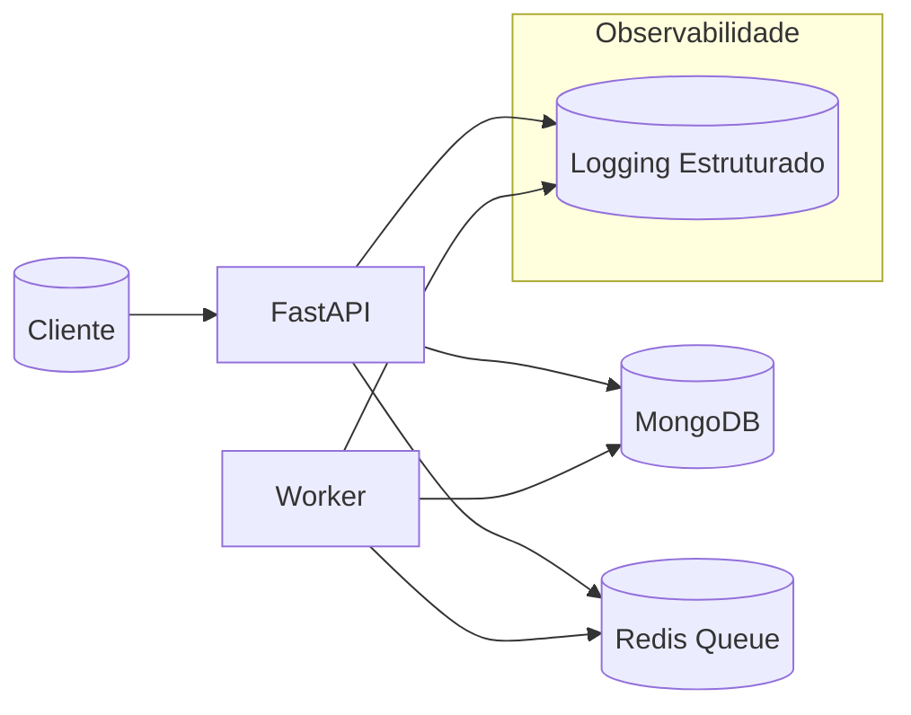

# 🏷️ Age Groups & Enrollment API

> **API robusta para cadastro de grupos etários e inscrições, com persistência em MongoDB, mensageria via Redis e processamento assíncrono por worker. Desenvolvida em FastAPI, pronta para rodar via Docker Compose.**

---

## 🚀 Visão Geral

Este projeto entrega uma solução completa para gestão de grupos etários e inscrições, com arquitetura moderna, observabilidade, validação de dados e processamento assíncrono. Ideal para cenários de triagem, eventos, ou qualquer contexto que exija controle de faixas etárias e filas de inscrição.

**Principais recursos:**
- API RESTful com autenticação básica
- Cadastro e consulta de grupos etários
- Inscrição de usuários com validação de CPF
- Fila de processamento via Redis
- Worker assíncrono para persistência e validação
- Código modular, com docstrings de contrato e logging detalhado para facilitar manutenção.

---

## 🧱 Arquitetura

Fluxo resumido: a API valida e registra a intenção de inscrição (status inicial `queued`), publica a mensagem na fila Redis; o worker consome, valida regras (CPF e faixa etária), cria o usuário associado e marca como `completed` ou `rejected` / `failed` conforme o caso.



Diagrama completo: [arquitetura-teste.pdf](./arquitetura-teste.pdf)

Características arquiteturais:
- Desacoplamento via fila (buffer/backpressure).
- Idempotência: worker só processa inscrições em `queued`.
- Simplicidade operacional (tudo em containers Docker Compose).
- Extensível para métricas (Prometheus) e tracing (OpenTelemetry) futuramente.

---

## 🛠️ Tecnologias

- **FastAPI**: API principal, endpoints REST
- **MongoDB**: armazenamento de grupos e inscrições
- **Redis**: mensageria e fila de inscrições
- **Python**: worker assíncrono, validação, integração
- **Docker Compose**: orquestração dos serviços

---

## 📦 Estrutura do Projeto

```
backend/
  api/
    app.py                # API principal (FastAPI)
    services/
      enrollment_service.py # Serviço de inscrição
    ...
  worker/
    consumer_enrollment.py # Worker da fila
  mongo/
    db.py                 # Conexão MongoDB
Dockerfile                # Build da API
requirements.txt          # Dependências Python
README.md                 # Documentação
```

---

## ⚡ Como Executar

1. **Clone o projeto:**
   `git clone https://github.com/gabriel-adutra/suthub-test.git && cd suthub-test`
2. **Suba os serviços:**
   `docker compose up --build`
3. **Acesse a API:**
   [http://localhost:3000](http://localhost:3000)

---

## 🔐 Autenticação

Todos os endpoints exigem HTTP Basic Auth:
- Usuário: `admin`
- Senha: `admin123`

---

## 📚 Endpoints Principais

### Status da API
- `GET /` → Retorna `{ "status": "ok" }`

### Grupos Etários
- `GET /api/v1/age-groups` → Lista todos os grupos
- `POST /api/v1/age-groups` → Cria novo grupo
- `DELETE /api/v1/age-groups/{group_id}` → Remove grupo

**Exemplo de criação:**
`curl -s -u admin:admin123 -X POST http://localhost:3000/api/v1/age-groups -H "Content-Type: application/json" -d '{"name":"Adulto","min_age":18,"max_age":99}' | jq .`

**Exemplo de listagem:**
`curl -s -u admin:admin123 http://localhost:3000/api/v1/age-groups | jq .`

**Exemplo de remoção:**
`curl -i -s -u admin:admin123 -X DELETE "http://localhost:3000/api/v1/age-groups/<GROUP_ID>"`

**Erros comuns:**
- `400 Bad Request`: Campos obrigatórios ausentes
- `409 Conflict`: Sobreposição de faixa
- `404 Not Found`: Grupo não encontrado

### Inscrição (Enrollment)
- `POST /api/v1/enrollments` → Solicita inscrição
- `GET /api/v1/enrollments/{enrollment_id}` → Consulta status da inscrição

**Exemplo de inscrição:**
`curl -s -u admin:admin123 -X POST http://localhost:3000/api/v1/enrollments -H "Content-Type: application/json" -d '{"name":"Joao Silva","age":30,"cpf":"09702414458"}' | jq .`

**Retorno esperado:**
```json
{
  "enrollment_id": "<ID>",
  "status": "queued"
}
```

**Exemplo de consulta de status:**
`curl -s -u admin:admin123 http://localhost:3000/api/v1/enrollments/<ID> | jq .`

**Erros comuns:**
- `422 Unprocessable Entity`: CPF inválido ou idade fora de faixa
- `400 Bad Request`: Campos obrigatórios ausentes
- `404 Not Found`: Inscrição não encontrada

---

## 📨 Mensageria & Worker

- Toda inscrição é enfileirada no Redis
- O worker (`backend/worker/consumer_enrollment.py`) consome a fila e persiste no MongoDB
- Status da inscrição: `queued` (aguardando processamento), `failed` (erro de fila), ou outros conforme evolução
Status da inscrição:
- `queued`: aguardando processamento
- `processing`: sendo processada pelo worker
- `completed`: inscrição processada e usuário persistido
- `failed`: erro de fila ou processamento
- `rejected`: inscrição rejeitada (CPF inválido ou faixa etária não encontrada)

---

## 🧑‍💻 Testes & Troubleshooting

- Certifique-se que todos os containers estão "healthy" (API, Mongo, Redis, Worker)
- Para logs detalhados, utilize:
  `docker compose logs api`
  `docker compose logs worker`
- Para testar CPF, use apenas números (sem pontos ou hífen)

---

## 💡 Observações & Expansão

- Próximos passos: testes automatizados, masking de dados sensíveis, métricas, monitoramento, etc.

---

## 🤝 Contribua

Sugestões, dúvidas ou melhorias? Abra uma issue ou envie um pull request!
